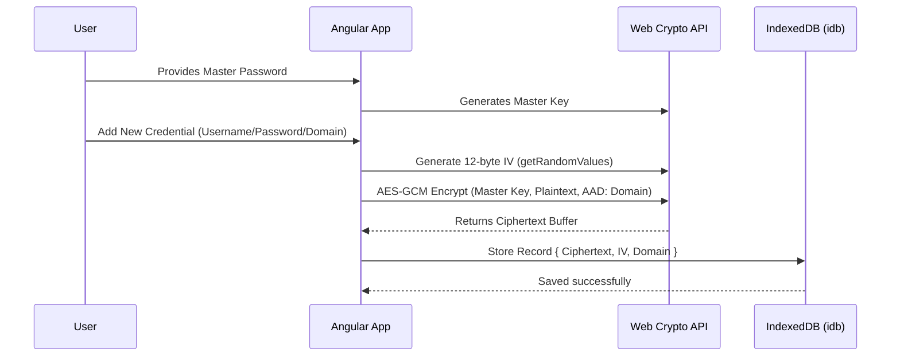
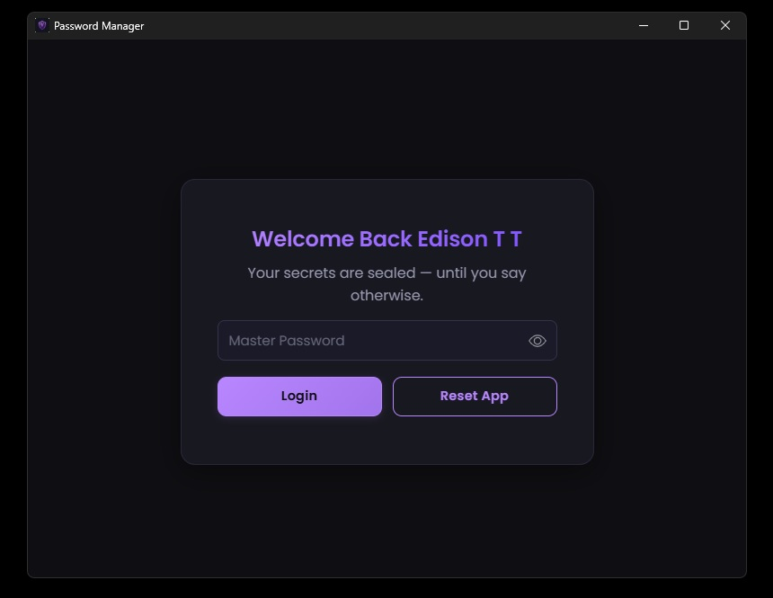
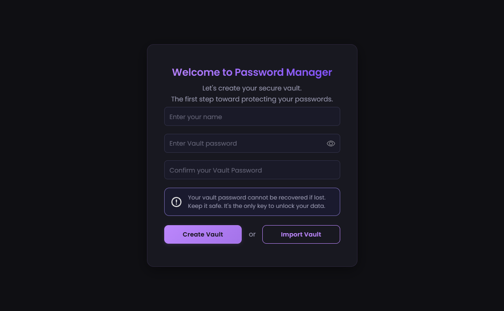
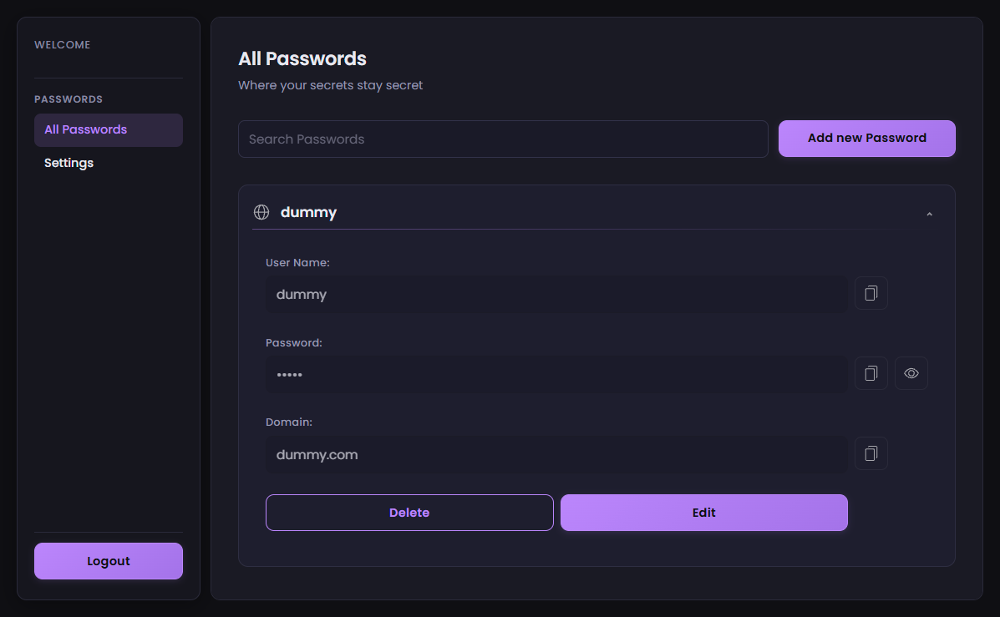
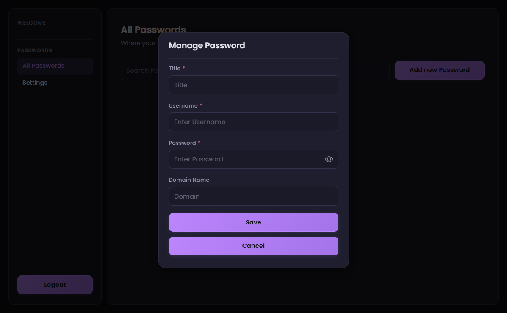

# Password Manager (Master Branch)

This is a secure, browser-based UI project built to help you safely manage your passwords. 

> [!NOTE]
> This is the **master** branch. This branch contains the core web application. For native or desktop wrappers, please check out the respective branches mentioned at the end of this document.

## Overview
This application provides a secure way to store passwords locally in your browser. All encryption and decryption happen client-side, ensuring that your data is secure on your device. 

### Packages & Technologies Used
- **Angular 20**: The core frontend framework used to build the single-page application.
- **RxJS**: For reactive programming and handling asynchronous data streams.
- **idb**: A lightweight wrapper for IndexedDB used for local storage.
- **Web Crypto API**: Native browser API for highly secure cryptographic operations (no external crypto libraries needed).

## Security & Encryption Flow

We utilize the native **Web Crypto API** to ensure maximum security without needing external dependencies like `crypto-js`.

### Encryption Details
- **Algorithm**: `AES-GCM` (Advanced Encryption Standard - Galois/Counter Mode) with 128-bit tag length.
- **IV (Initialization Vector)**: 96-bit (12 bytes) random values generated cryptographically for each entry via `crypto.getRandomValues`.
- **Integrity (AAD)**: We optionally use the target domain as **AAD (Additional Authenticated Data)** to ensure the ciphertext hasn't been tampered with and is strictly bound to that domain.

## Screenshots

Here are some previews of the application:

## Storage Details

We use **IndexedDB** (via the `idb` package) to store encrypted data securely within the browser storage.
- **Store - Entries**: Contains the user's encrypted credentials.
- **Store - Metadata**: Contains vault-level metadata.

No plain text data (username or password) is ever saved to the database. Everything is normalized to `Uint8Array` binary formats before storage and decoding.

## Repository Branches

This repository supports multiple deployment targets via separate branches. You can explore them using `git branch`:

- `* master` (Current: Core web app)
- `android-app` (Android mobile wrapper - **In Progress**)
- `electron-app` (Desktop wrapper)
- `revamp` (UI/UX updates)
- `tauri-app` (Tauri desktop wrapper)

*(Note: We maintain separate branches for Tauri and Electron implementations to keep the core web app clean.)*
